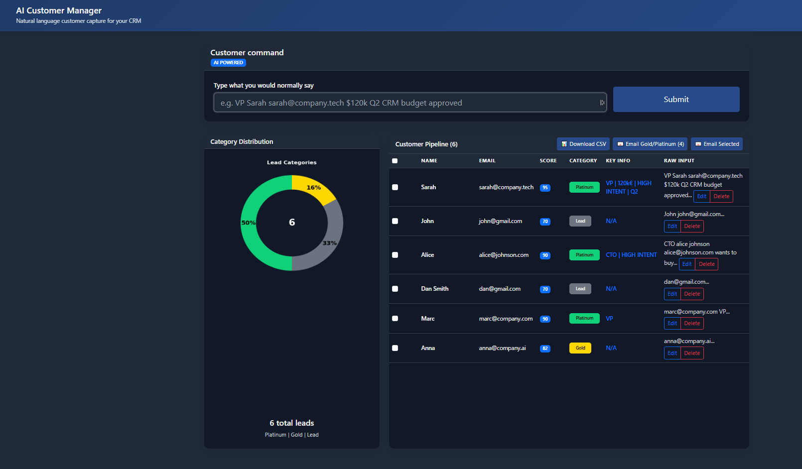

text
# AI Customer Manager 

*** 
AI CRM that eliminates 4 hours daily SDR data entry.

One sentence → Instant pipeline. Bulk E-mail.

No forms. No typing. No spreadsheets. Natural language → Smart CRM. SDRs close deals, not data entry.***


##  Features

| Feature | Description                                                                                   |
|---------|-----------------------------------------------------------------------------------------------|
|  **AI Lead Extraction** | Type naturally: "VP Sarah [sarah@acme.com] wants $120k Q2" → Auto-parses name/email/key notes |
|  **Smart Scoring** | 70-95 score based on titles, budget, urgency, premium domains                                 |
|  **3-Tier Pipeline** | Lead → Gold → Platinum categorization                                                         |
|  **Bulk Gmail** | One-click compose for Gold/Platinum leads (staggered tabs)                                    |
|  **Donut Analytics** | Live % distribution + total count in center                                                   |
|  **CSV Export** | Download full pipeline                                                                        |
|️ **Inline Edit** | Edit any lead directly                                                                        |

##  Quick Start

```bash
# 1. Get Gemini API key
export API_KEY="your_gemini_api_key_here"

# 2. Install dependencies
pip install flask google-generativeai matplotlib

# 3. Run
python main.py